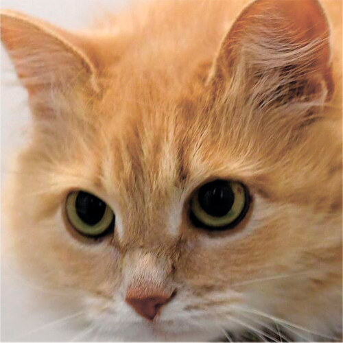
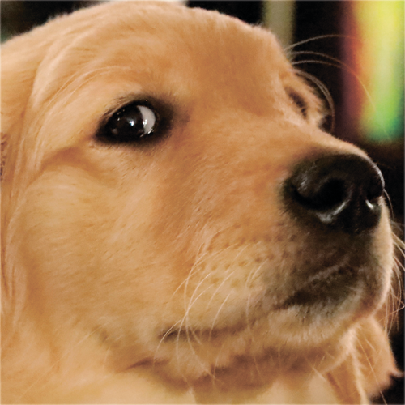
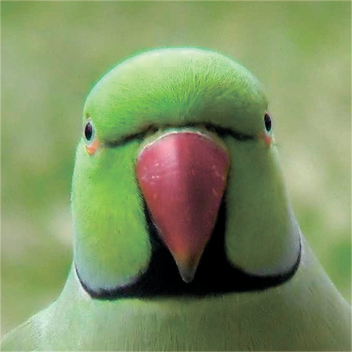

# 2-html-css-alignment-and-displays
## html-css выравнивание и отображение

Создадим страницу с изображениями животных и будем по разному их отображать. 
```html
<!DOCTYPE html>
<html lang="en">
<head>
    <meta charset="UTF-8">
    <meta name="viewport" content="width=device-width, initial-scale=1.0">
    <link rel="stylesheet" href="style.css">
    <title>animals</title>
</head>
<body>
    <div id="animal-box">
        
        
        
        
    </div>
</body>
</html>
```
```css
.animal {
    width: 300px;
}

#animal-box {
    width: 50%;
    border: 1px black solid;
    margin: 0 auto 0 auto;
}
```
* `div animal-box` - это контейнер для изображений. Пусть его ширина будет 50% от всей страницы и создадим ему рамку для удобства. Внешними отступами `margin` поместим его по-центру.
* Самим же изображениям зададим один общий класс для установки ширины.


